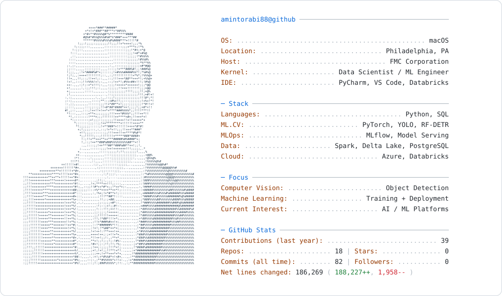

# Amin Torabi

Data Scientist / ML Engineer · Philadelphia, PA

<picture>
  <source media="(prefers-color-scheme: dark)" srcset="./dark_mode.svg">
  <source media="(prefers-color-scheme: light)" srcset="./light_mode.svg">
  
</picture>

Statistics refresh daily. Contributions (last year) uses GitHub’s contribution calendar total, including private activity visible to the configured token. Commits (all time) is a separate count. N/A means unavailable. Net lines changed totals additions minus deletions in authored commits on owned, non-fork repositories’ default branches.

<!-- Maintainer setup: Enable "Private contributions" under the profile's
Contribution settings. For private/internal contribution access, add an
owner personal access token with read:user scope as the ACCESS_TOKEN Actions
repository secret. Never put the token in this file. Then run Update profile
stats from the Actions tab. Organization policies can limit visibility. -->
